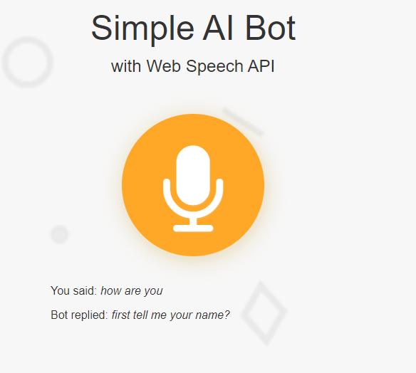

# GPT Audio Web-App

> This is a simple AI bot made with nodejs, web speech api and [dialogflow](https://dialogflow.cloud.google.com/#/getStarted)



### [Live Preview](https://gpt-audio-web-app-dqre.onrender.com)

This is how this web app works:

1. Using the Web Speech API’s SpeechRecognition interface to listen your voice from a microphone.
1. Send your message to dialogflow agent (the natural language processing platform) as a text string.
1. Once the AI from the agent returns the reply text back, use the SpeechSynthesis interface to give it a synthetic voice.

## Supported Browser

- [Google Chrome](https://google.com)

## Project Setup

```bash
#install dependencies
npm install

#install nodemon
npm install -g nodemon
```


## Run App

```bash
#Run in dev mode
npm run dev
#Run in prod mode
npm start
```

